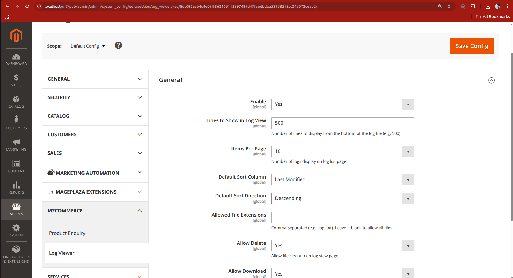
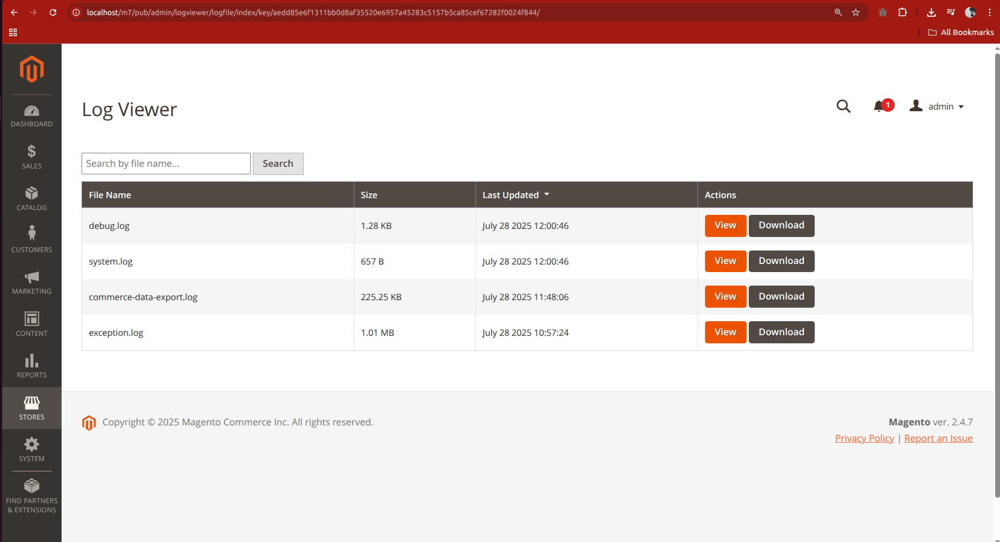
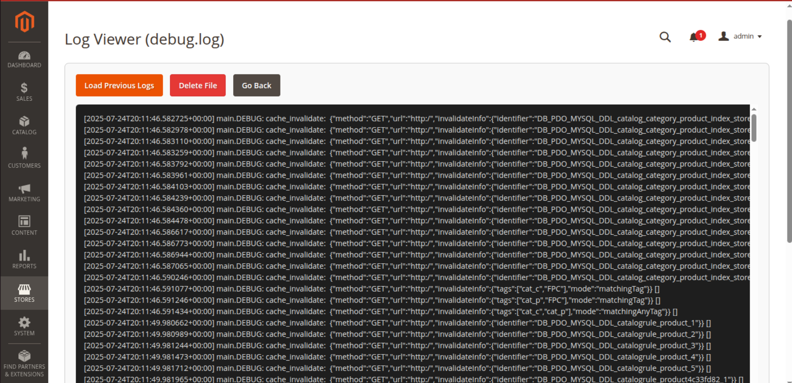
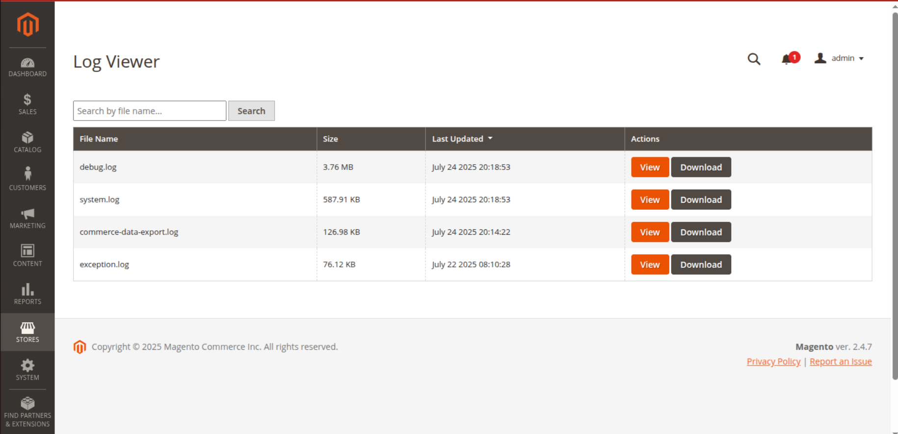

# BugsBunny: Magento 2 Log Viewer Module

This Magento 2 extension provides a convenient **Admin Panel interface** for viewing Magento system logs (`system.log`, `debug.log`, etc.) directly from the backend — without needing FTP or SSH access.

It supports real-time log tailing and keyword filtering, making it easier for developers and store owners to debug and monitor the site without leaving the admin panel.

---

## 🎯 Features

- View Magento logs (`system.log`, `debug.log`, etc.) directly in the admin panel
- Filter logs by keyword
- Tail logs (see most recent entries first)
- Fully configurable from admin settings
- Works with custom logs from `/var/log/`
- Lightweight, no external dependencies

---

## ⚙️ Configuration

Go to:  
**Stores > Configuration > BugsBunny > Log Viewer**

You will find the following options:

- **Enabled** – Enable or disable log viewer functionality
- **Allowed Log Files** – List of log files (comma-separated) you want to allow access to (e.g., `system.log,debug.log`)
- **Lines to Show** – Number of log lines to display (e.g., 100)

---

## 📍 Output Location

Once enabled, navigate to the admin route:
```
Admin > Bugs Bunny > Log Viewer
```
# Example Output Search





Then run the following Magento CLI commands:

```bash
php bin/magento module:enable BugsBunny_LogViewer
php bin/magento setup:upgrade
php bin/magento setup:di:compile
php bin/magento cache:clean
php bin/magento cache:flush
```
